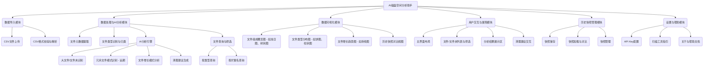
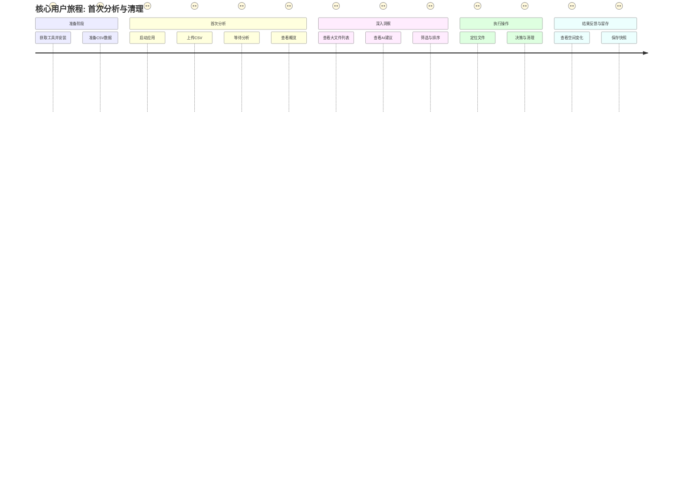
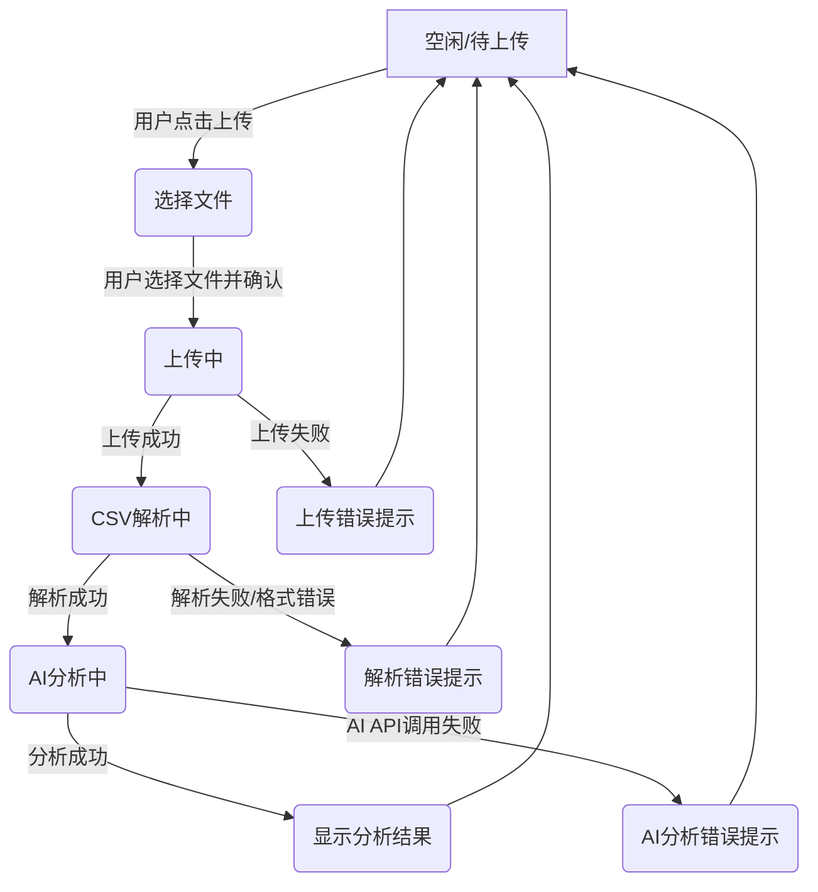

# 产品需求文档 (PRD)

## 1. 文档信息

### 1.1 版本历史

| 版本 | 日期       | 作者 | 变更说明 |
| ---- | ---------- | ---- | -------- |
| 0.1  | YYYY-MM-DD | Trae AI | 初稿创建 |

### 1.2 文档目的

本文档旨在明确定义“AI磁盘空间分析助手”产品的需求，作为产品设计、开发、测试和运营的依据。

### 1.3 相关文档引用

- [产品路线图 (Roadmap)](./Roadmap.md)
- [用户故事地图 (User Story Map)](./User_Story_Map.md)
- [产品评估指标框架 (Metrics Framework)](./Metrics_Framework.md)

## 2. 产品概述

### 2.1 产品名称与定位

- **产品名称**: AI磁盘空间分析助手 (暂定)
- **产品定位**: 一款利用AI技术分析磁盘扫描数据（如WizTree导出的CSV文件），帮助用户理解文件组成、识别大文件/冗余文件、追踪文件增长趋势，并提供清理建议的智能工具。

### 2.2 产品愿景与使命

- **产品愿景**: 成为用户管理和优化磁盘空间的首选智能助手。
- **产品使命**: 通过智能化分析和可视化呈现，让磁盘空间管理更简单、高效、直观。

### 2.3 价值主张与独特卖点(USP)

- **价值主张**: 智能分析磁盘数据，轻松释放存储空间，洞察文件变化趋势。
- **独特卖点(USP)**:
    - **AI驱动的智能分析**: 超越传统工具的简单统计，提供更深层次的洞察和建议。
    - **趋势可视化**: 清晰展示文件/文件夹随时间的变化，帮助用户理解存储增长模式。
    - **与现有工具集成**: 支持导入WizTree等流行磁盘扫描工具的CSV数据，降低用户使用门槛。
    - **个性化清理建议**: 基于AI分析结果，提供针对性的文件清理建议。

### 2.4 目标平台列表

- **初期目标平台**: 
    - Windows桌面应用程序 (核心功能实现)
- **远期考虑平台**:
    - macOS桌面应用程序
    - Web版本 (用于数据同步和跨平台查看)

### 2.5 产品核心假设

- 用户愿意使用第三方工具（如WizTree）扫描磁盘并导出CSV文件。
- 用户能够理解AI分析提供的基本图表和建议。
- AI分析的准确性和实用性能够满足用户清理磁盘空间的需求。
- 用户对文件增长趋势和历史快照功能有需求。

### 2.6 商业模式概述 (如适用)

- **初期**: 免费增值模式。基础分析功能免费，高级分析功能（如更长时间的趋势分析、更深度的AI洞察、自动清理建议等）付费。
- **考虑方向**: 一次性购买或订阅制。

## 3. 用户研究

### 3.1 目标用户画像 (详细)

#### 3.1.1 用户画像1: 技术爱好者/高级用户

- **人口统计特征**: 年龄25-45岁，男性居多，通常具有一定的计算机知识背景。
- **行为习惯与偏好**: 
    - 频繁使用电脑，对系统性能和存储空间敏感。
    - 喜欢尝试新工具，追求效率。
    - 习惯使用如WizTree, SpaceSniffer等磁盘分析工具。
    - 关注数据隐私和安全。
- **核心需求与痛点**:
    - 快速定位占用空间大的文件和文件夹。
    - 理解哪些文件类型增长最快。
    - 需要定期清理磁盘，但手动分析耗时费力。
    - 希望能看到历史数据，了解存储变化。
- **动机与目标**: 
    - 保持系统流畅运行，避免因磁盘空间不足导致的问题。
    - 高效管理数字资产。
    - 探索更智能的磁盘管理方式。

#### 3.1.2 用户画像2: 普通电脑用户

- **人口统计特征**: 年龄18-55岁，性别不限，对计算机技术了解不多。
- **行为习惯与偏好**: 
    - 日常使用电脑进行办公、学习或娱乐。
    - 当电脑提示磁盘空间不足时才会关注。
    - 对复杂的技术操作感到困惑。
    - 倾向于简单易懂的解决方案。
- **核心需求与痛点**:
    - 电脑变慢，怀疑是磁盘满了。
    - 不知道哪些文件可以安全删除。
    - 害怕误删重要文件。
    - 希望有一键清理或明确的清理指引。
- **动机与目标**: 
    - 解决磁盘空间不足的问题，让电脑恢复正常使用。
    - 简单、安全地释放存储空间。

### 3.2 用户场景分析

#### 3.2.1 核心使用场景详述

- **场景1: 磁盘空间告急，快速定位大文件进行清理**
    - **用户**: 小王 (技术爱好者)
    - **情景**: 小王的C盘突然爆红，系统提示空间不足。他运行了WizTree扫描，导出了CSV文件。
    - **操作**: 打开“AI磁盘空间分析助手”，上传CSV文件。应用快速分析并高亮显示最大的几个文件和文件夹，并给出初步的清理建议（如“临时文件”、“大型视频文件”）。小王根据建议，结合自己的判断，删除了部分文件，成功释放空间。
- **场景2: 定期检查磁盘，了解文件增长情况**
    - **用户**: 李姐 (普通用户)
    - **情景**: 李姐的电脑最近感觉有点慢，她听说这个工具可以帮忙分析。她按照教程导出了CSV。
    - **操作**: 上传CSV后，工具不仅显示了当前文件分布，还提示她可以保存本次快照。几周后，她再次上传新的CSV，工具对比两次快照，显示“照片”文件夹增长了5GB，并指出了具体的新增的大型相册文件夹。李姐据此将部分照片备份到移动硬盘。
- **场景3: 分析特定项目文件夹，优化存储**
    - **用户**: 张工 (开发者)
    - **情景**: 张工的开发项目文件夹越来越大，想知道具体是哪些部分（如编译缓存、日志、依赖库）占用了主要空间。
    - **操作**: 他使用WizTree单独扫描项目文件夹并导出CSV。上传到工具后，AI分析指出`node_modules`和编译输出目录是主要占用者。工具还提供了按文件类型和最后修改时间筛选的功能，帮助张工识别不再需要的旧版本库和日志。

#### 3.2.2 边缘使用场景考量

- 分析移动硬盘或网络驱动器的扫描数据。
- 导入非标准格式但结构类似的CSV文件 (需要容错处理或格式提示)。
- 用户希望分享分析报告给他人。

### 3.3 用户调研洞察 (如适用)

- (后续根据实际调研补充)

## 4. 市场与竞品分析

### 4.1 市场规模与增长预测

- 个人电脑用户基数庞大，磁盘空间管理是普遍需求。
- 随着高清媒体、大型应用和游戏文件的增多，用户对存储空间的需求持续增长。
- 智能分析工具市场尚处于发展初期，有较大潜力。

### 4.2 行业趋势分析

- AI技术在各类工具软件中的应用逐渐普及。
- 用户对个性化、智能化服务的期望越来越高。
- 数据可视化成为复杂信息呈现的重要手段。
- 云存储的普及也在改变用户管理本地文件的方式，但本地存储优化依然重要。

### 4.3 竞争格局分析

#### 4.3.1 直接竞争对手详析

- **WizTree, SpaceSniffer, TreeSize Free/Professional**: 
    - **优势**: 扫描速度快，界面直观，用户基数大，功能成熟稳定。
    - **劣势**: 主要是扫描和展示，缺乏深度分析、趋势追踪和智能建议功能。专业版可能收费。
    - **定价**: 免费版功能受限，专业版付费。
    - **特性对比**: 我们的产品侧重于扫描后的AI分析和趋势洞察，是对这类工具的补充和增强。
- **DaisyDisk (macOS)**:
    - **优势**: UI美观，交互体验好，分析直观。
    - **劣势**: macOS平台限定，缺乏AI分析和历史趋势。
    - **定价**: 付费软件。

#### 4.3.2 间接竞争对手概述

- **CCleaner等系统清理工具**: 提供磁盘清理功能，但侧重于缓存、垃圾文件，对用户个人大文件的分析较弱。
- **云存储服务 (如Dropbox, Google Drive, OneDrive)**: 通过将文件移至云端间接解决本地存储问题，但不能完全替代本地磁盘管理。

### 4.4 竞品功能对比矩阵

| 功能点             | 本产品 (AI磁盘分析助手) | WizTree/SpaceSniffer | TreeSize Pro | DaisyDisk | CCleaner | 备注 |
| ------------------ | --------------------- | -------------------- | ------------ | --------- | -------- | ---- |
| 磁盘扫描           | 依赖外部工具 (CSV导入) | ✔️ (核心功能)        | ✔️           | ✔️        | ✔️ (部分) |      |
| 文件组成可视化     | ✔️ (AI增强)           | ✔️ (基础)            | ✔️           | ✔️ (美观) | △ (有限) |      |
| 大文件定位         | ✔️ (AI高亮)           | ✔️                   | ✔️           | ✔️        | △        |      |
| 重复文件查找       | 计划 (AI辅助)         | △ (部分有)           | ✔️           | △         | ✔️        |      |
| **AI智能分析**     | ✔️ (核心)             | ❌                   | ❌           | ❌        | ❌        | USP  |
| **文件增长趋势**   | ✔️ (核心)             | ❌                   | △ (快照对比) | ❌        | ❌        | USP  |
| **历史快照对比**   | ✔️ (核心)             | ❌                   | ✔️           | ❌        | ❌        | USP  |
| **个性化清理建议** | ✔️ (AI驱动)           | ❌                   | ❌           | ❌        | △ (通用) | USP  |
| 跨平台 (Win/Mac)   | 计划 (Win优先)        | Win                  | Win          | Mac       | Win/Mac  |      |
| 导出分析报告       | ✔️                     | △ (CSV/TXT)          | ✔️           | △         | △        |      |
| **按类型/后缀名查询文件** | ✔️                     | ❌                   | △ (部分支持) | △ (部分支持) | ❌        | 新增 |

### 4.5 市场差异化策略

- **聚焦AI分析**: 强调产品的智能化，提供超越传统工具的洞察力。
- **历史趋势与快照**: 满足用户对文件变化追踪的需求，这是多数竞品不具备的。
- **开放集成**: 通过支持主流扫描工具的CSV导入，快速获取用户，并专注于分析能力的提升。
- **用户体验**: 简洁易用的界面，清晰的可视化图表，降低用户理解门槛。

## 5. 产品功能需求

### 5.1 功能架构与模块划分

### 5.2 核心功能详述

#### 5.2.X 文件查询与筛选 (新增)

- **功能ID**: F00X
- **功能名称**: 按文件类型或扩展名查询
- **优先级**: 高 (补充MVP功能)
- **关联用户故事**: 作为用户，我希望能按文件类型（如“视频”）或扩展名（如“.exe”）筛选文件列表，以便快速找到我关心的文件。
- **描述**: 用户能够通过界面或命令行参数指定文件类别（如“图片”、“视频”、“文档”）或具体的文件扩展名（如“jpg”, “mp4”, “exe”），系统将基于已加载的CSV数据，筛选并展示所有匹配条件的文件及其详细信息（路径、大小）。
- **用户价值**: 
    - 快速定位特定类型的文件，便于针对性管理和清理。
    - 增强对磁盘内容按自定义标准进行探索的能力。
- **验收标准**:
    - 系统能够接收用户输入的查询类型（类别/扩展名）和查询值。
    - 系统能够准确返回匹配查询条件的文件列表，包含每个文件的名称、完整路径、大小。
    - 如果没有文件匹配查询条件，系统应给出明确的提示信息。
    - 查询功能应能正确处理大小写不敏感的扩展名和类别名输入。
    - 查询结果应清晰展示，易于用户阅读。

#### 5.2.1 数据导入模块

- **功能描述**: 作为用户，我想要上传WizTree等工具导出的CSV文件，以便应用可以分析我的磁盘数据。
- **用户价值**: 方便用户利用现有工具的扫描结果，快速开始分析。
- **功能逻辑与规则**:
    - 支持通过文件选择对话框上传单个CSV文件。
    - 对CSV文件的格式进行初步校验（例如，检查是否包含预期的列名，如`File Name`, `Size`, `Path`, `Date Modified`等）。
    - 解析CSV文件，将数据加载到内存或临时数据库中进行处理。
    - 错误处理：文件格式不正确、文件过大无法处理等情况，应给出明确提示。
- **交互要求**: 清晰的上传按钮/拖拽区域，上传进度提示（对大文件）。
- **数据需求**: CSV文件内容，包含文件路径、大小、修改日期等关键信息。
- **技术依赖**: Python CSV解析库 (如pandas)。
- **验收标准**:
    - 成功上传并解析符合WizTree标准格式的CSV文件。
    - 对不符合格式的CSV文件能给出错误提示。
    - 上传1GB大小的CSV文件（模拟大量文件数据）能在30秒内完成解析（或给出处理中提示）。

#### 5.2.2 数据处理与AI分析模块

- **功能描述**: 作为用户，我想要应用能够智能分析我上传的磁盘数据，识别出文件组成、大文件和潜在的可清理项，以便我了解磁盘状况并做出决策。
- **用户价值**: 提供比手动查看更深入、更智能的磁盘数据洞察。
- **功能逻辑与规则**:
    - **文件元数据提取**: 从解析后的数据中提取完整路径、文件名、扩展名、大小、创建日期、修改日期等。
    - **文件类型识别与归类**: 根据文件扩展名或MIME类型（如果CSV提供）对文件进行分类（如文档、图片、视频、音频、应用程序、压缩包、系统文件、其他等）。
    - **AI分析引擎 (V1 - 基础)**:
        - **大文件/文件夹识别**: 自动识别并排序占用空间最大的N个文件和文件夹。
        - **文件增长模式分析 (基于快照对比)**: 对比不同时间的快照，计算文件/文件夹大小变化，识别增长最快的部分。
        - **清理建议生成 (V1 - 规则)**: 基于文件类型、大小、最后访问/修改时间（如果CSV提供）等规则，生成初步清理建议，并提供明确的理由，帮助用户判断文件是否可以删除（例如，“超过1GB的大型视频文件，且超过1年未访问”，“超过6个月未修改的临时文件，通常可安全删除”）。
    - **AI API集成**: 
        - **目标**: 将处理后的结构化数据（或其摘要）发送到AI API进行深度分析，以提供更智能的洞察和建议。接收API返回的结果并整合到应用的分析报告中。
        - **API能力要求**: 需要具备全面的分析能力，包括但不限于大文件识别、冗余文件模式识别（远期）、文件增长模式分析，并能为清理建议提供明确的、用户易于理解的理由。
        - **成本与选型策略**: 
            - 优先寻找免费或低成本的API解决方案，考虑到CSV文件可能较大（几十MB到几百MB），且项目初期预算有限。
            - 仅在特定API功能对项目有显著价值且无法通过免费/低成本方案替代时，才考虑少量付费。
            - API选型将综合考量功能匹配度、易部署性、稳定性和成本效益，无论是专门的文件分析API还是通用的文本分析/模式识别API。
        - **数据处理量**: 需考虑API对处理数据大小的限制和相应的成本。
        - **集成方式**: 可能是通过SDK或直接HTTP调用。
    - **隐私处理与用户选择**: 
        - 初期阶段，可优先选择不涉及敏感数据传输或提供明确数据处理策略的API。
        - 远期考虑允许用户自行选择信任的AI服务商并配置API Key，或将高级隐私保护功能作为增值服务提供。
        - 在向外部API发送数据前，明确告知用户数据将如何被使用，并尽可能提供脱敏选项或仅发送必要的统计数据。
- **交互要求**: 分析过程应有进度提示。分析结果应清晰易懂。
- **数据需求**: 解析后的文件列表数据，AI API的输入输出格式定义。
- **技术依赖**: Python数据处理库 (pandas, numpy)，AI API的SDK或HTTP客户端，以及新引入的 `src/ai_analyzer.py` 模块用于封装AI交互逻辑。
        - **AI模块配置**: AI分析功能依赖于环境变量 `AI_SERVICE_API_KEY` (必需) 和 `AI_SERVICE_ENDPOINT` (可选) 的正确设置。如果未配置API密钥，AI分析将使用占位符响应。
- **验收标准**:
    - 能够准确识别并列出Top 10大文件和Top 10大文件夹。
    - 能够根据文件扩展名对至少20种常见文件类型进行正确归类。
    - （依赖AI API）能够调用AI API并正确处理返回结果，展示AI分析的摘要或关键点。
    - 能够基于预设规则（如文件大小 > 1GB且修改时间 > 180天前）生成清理建议。

#### 5.2.3 数据可视化模块

- **功能描述**: 作为用户，我想要通过直观的图表查看磁盘空间占用情况、文件类型分布和文件增长趋势，以便我能快速理解数据。
- **用户价值**: 将复杂的磁盘数据以易于理解的方式呈现，提升分析效率。
- **功能逻辑与规则**:
    - **文件组成概览图**: 使用旭日图或树状图（Treemap）展示文件夹层级和大小占比。
    - **文件类型分布图**: 使用饼图或柱状图展示各类文件占用的空间比例。
    - **文件增长趋势图 (基于快照)**: 使用折线图展示选定文件/文件夹或总体空间在不同快照时间点的大小变化。
    - **历史快照对比视图**: 并排或叠加展示两个快照的分析结果，高亮差异部分。
    - 图表应支持基本交互，如鼠标悬停显示详细信息，点击图例筛选等。
- **交互要求**: 图表美观、清晰，响应快速。关键信息突出显示。
- **数据需求**: 结构化的分析结果数据，用于生成图表。
- **技术依赖**: Python绘图库 (如Matplotlib, Seaborn, Plotly, or ECharts的Python封装)。对于桌面应用，可能需要与GUI框架集成。
- **验收标准**:
    - 能够正确生成旭日图/树状图，准确反映文件夹大小和层级关系。
    - 能够正确生成文件类型分布饼图/柱状图。
    - 若存在至少2个历史快照，能够生成文件/总空间增长的折线图。
    - 图表数据与原始分析结果一致。

#### 5.2.4 用户交互与展现模块

- **功能描述**: 作为用户，我想要在一个清晰易用的界面上查看所有分析结果、筛选文件、并执行清理操作（或获取清理指引），以便我能高效管理磁盘。
- **用户价值**: 提供友好的用户界面，整合各项功能，提升产品易用性。
- **功能逻辑与规则**:
    - **主界面布局**: 包含数据上传区、分析结果展示区（图表、列表）、筛选排序区、操作按钮区。
    - **文件/文件夹列表**: 以表格形式展示文件/文件夹详细信息（名称、路径、大小、类型、修改日期等），支持按列排序。
    - **筛选功能**: 支持按文件类型、大小范围、日期范围等条件筛选文件列表。
    - **分析结果展示**: 结构化展示AI分析的结论、建议、图表。
    - **清理建议交互**: 清晰展示建议清理的文件/文件夹，用户可以选择接受建议（如标记待删除，或直接提供删除指引——不直接删除，而是帮助用户在文件管理器中定位）。
    - **导出报告**: 支持将分析结果（包括图表和列表）导出为HTML或PDF报告。
- **交互要求**: 界面简洁直观，操作符合用户习惯。重要信息醒目。
- **数据需求**: 所有分析模块产生的数据，用户配置信息。
- **技术依赖**: GUI框架 (如PyQt, Tkinter, Kivy, or Web框架如Flask/Django + 前端技术用于桌面封装)。
- **验收标准**:
    - 主界面能正确展示所有核心功能模块的入口和信息区域。
    - 文件列表能正确显示数据，并支持按大小、修改日期排序。
    - 筛选功能按预期工作（例如，筛选出所有大于100MB的视频文件）。
    - 清理建议能清晰展示，并提供定位到文件的功能。

#### 5.2.5 历史快照管理模块

- **功能描述**: 作为用户，我想要保存某次磁盘分析的结果作为快照，并在未来与新的分析结果进行对比，以便我追踪文件和文件夹的变化情况。
- **用户价值**: 实现磁盘空间使用的历史追踪和趋势分析。
- **功能逻辑与规则**:
    - **快照保存**: 用户可以将当前的分析结果（包括文件列表摘要、统计数据）保存为一个命名快照，记录保存时间。
    - **快照加载**: 用户可以加载已保存的快照，查看当时的分析结果。
    - **快照对比**: 用户可以选择两个快照进行对比，系统分析并展示两者之间的差异（如新增文件、删除文件、文件大小变化等）。
    - **快照管理**: 用户可以查看已保存的快照列表，重命名或删除快照。
    - 快照数据应存储在本地（如SQLite数据库或JSON文件）。
- **交互要求**: 快照操作简单明了，对比结果清晰易懂。
- **数据需求**: 每次分析的核心数据摘要，快照元数据（名称、时间）。
- **技术依赖**: 本地数据存储方案 (SQLite, JSON文件)。
- **验收标准**:
    - 能够成功保存当前分析结果为快照，并记录时间戳。
    - 能够加载已保存的快照并展示其分析数据。
    - 选择两个不同的快照后，能够高亮显示文件大小变化超过10%的项目。
    - 用户可以删除指定的快照。

### 5.3 次要功能描述 (可简化结构)

- **API Key配置**: 用户可以输入和保存用于AI分析服务的API Key。
- **扫描工具指引**: 提供简要教程，指导用户如何使用WizTree等工具扫描并导出CSV。
- **多语言支持 (远期)**: 支持中文、英文界面。
- **主题切换 (远期)**: 提供浅色、深色主题。

### 5.4 未来功能储备 (Backlog)

- **直接与扫描工具集成 (远期)**: 调用WizTree等的命令行接口直接扫描，而非手动导入CSV。
- **重复文件查找与分析**: 识别磁盘上的重复文件，并提供清理建议。
- **更高级的AI分析**: 
    - 预测未来磁盘空间使用趋势。
    - 基于用户行为模式的智能清理提醒。
    - 识别异常文件活动（如勒索软件加密特征 - 极远期，需谨慎）。
- **云端同步与备份 (远期)**: 将分析结果和快照同步到云端，实现跨设备查看。
- **插件系统 (极远期)**: 允许开发者扩展分析能力或支持更多数据源。

## 6. 用户流程与交互设计指导

### 6.1 核心用户旅程地图

### 6.2 关键流程详述与状态转换图

#### 6.2.1 CSV上传与分析流程

### 6.3 对设计师 (UI/UX Agent) 的界面原型参考说明和要求

- **简洁至上**: 避免信息过载，突出核心功能和数据。
- **可视化优先**: 优先使用图表展示数据，使信息直观易懂。
- **引导性操作**: 对于首次使用的用户，应有清晰的操作指引（如“请先上传CSV文件”）。
- **关键信息突出**: 如最大的文件、AI的核心建议，应使用醒目的方式展示。
- **交互反馈及时**: 如上传、分析过程应有明确的进度反馈。
- **一致性**: 整体设计风格、控件使用应保持一致。
- **可定制性 (初步)**: 考虑字体大小调整、简单的颜色主题（如亮色/暗色模式）。
- **参考原型**: 可以参考WizTree的布局，但更侧重于分析结果的呈现而非文件树的浏览。同时借鉴一些数据分析仪表盘的设计。

### 6.4 交互设计规范与原则建议 (如适用)

- **尼尔森十大可用性原则**: 作为基础指导。
- **减少用户认知负荷**: 信息分层展示，避免一次性呈现过多内容。
- **提供明确的退出和撤销机制 (如适用)**: 对于保存快照等操作。

## 7. 非功能需求

### 7.1 性能需求

- **CSV解析速度**: 对于100万行记录的CSV文件（约100-200MB），解析和初步处理时间应在60秒以内。
- **AI分析时间**: 调用外部AI API的响应时间依赖于API服务商，应用本身处理和整合结果的时间不应超过10秒。
- **图表渲染速度**: 常用图表（如饼图、旭日图）的渲染时间应在2秒以内。
- **应用启动时间**: 冷启动时间应在5秒以内。
- **内存占用**: 应用在分析中等规模CSV（如50万行）时，内存占用峰值不应超过500MB。

### 7.2 安全需求

- **API Key保护**: 用户输入的API Key应在本地加密存储，或仅在内存中使用，不应明文硬编码或记录在日志中。
- **数据隐私**: 
    - 上传的CSV数据仅在本地处理，除非用户明确同意，否则不应上传完整文件内容到任何第三方服务器（AI API除外，且应明确告知用户哪些数据会被发送）。
    - 若发送数据到AI API，应考虑数据脱敏方案，如仅发送文件大小、类型、层级结构等统计信息，而非完整文件名和路径。
    - 生成的分析报告若包含敏感路径，用户导出时应有提示。
- **本地数据安全**: 保存的快照数据应存储在用户目录下，避免权限问题。

### 7.3 可用性与可访问性标准

- **易用性**: 
    - 新用户能在5分钟内理解核心功能并完成一次分析。
    - 界面文字清晰易懂，无歧义。
    - 提供必要的帮助文档和操作指引。
- **可访问性 (WCAG - 初步考虑)**:
    - 确保足够的色彩对比度。
    - 支持键盘导航（对桌面应用）。
    - （远期）考虑屏幕阅读器的兼容性。

### 7.4 合规性要求

- **GDPR (如面向欧盟用户)**: 明确告知用户数据如何被收集、处理和存储，提供数据导出和删除的权利（针对用户账户体系，如果未来引入）。
- **本地法律法规**: 遵守用户所在地的个人信息保护法规。

### 7.5 数据统计与分析需求 (需要埋点跟踪的关键事件和指标)

- **核心功能使用频率**: 
    - CSV上传次数。
    - AI分析成功/失败次数。
    - 快照保存次数。
    - 快照对比次数。
- **用户行为**: 
    - 各类图表的查看频率。
    - 清理建议的采纳率（通过追踪“定位文件”按钮点击）。
    - 筛选功能的使用情况。
- **性能指标**: 
    - CSV解析平均耗时。
    - AI分析平均耗时。
- **错误监控**: 
    - CSV解析失败类型及频率。
    - AI API调用失败类型及频率。
    - 应用崩溃报告。

## 8. 技术架构考量

### 8.1 技术栈建议

- **后端/核心逻辑**: Python 3.x
    - **数据处理**: Pandas, NumPy
    - **AI API交互**: Requests, or specific AI provider's SDK
    - **本地存储**: SQLite (for snapshots, settings), JSON
- **GUI (Windows桌面)**: 
    - PyQt6/PySide6 (功能强大，社区成熟)
    - Tkinter (Python内置，简单应用可选)
    - CustomTkinter (基于Tkinter的现代化UI库)
    - Kivy (跨平台，但学习曲线稍陡)
    - Electron/Tauri (使用Web技术构建桌面应用，若团队熟悉Web栈)
- **数据可视化**: 
    - Matplotlib/Seaborn (静态图，可嵌入GUI)
    - Plotly (交互式图表，可嵌入GUI或导出HTML)
    - ECharts (通过Python封装如pyecharts，生成HTML或嵌入WebView)
- **打包**: PyInstaller, cx_Freeze (for creating executables)

### 8.2 系统集成需求

- **AI API**: 通过 `src/ai_analyzer.py` 模块与用户选择的AI服务提供商的API进行集成。该模块负责处理API的认证（通过环境变量 `AI_SERVICE_API_KEY`）、请求构造、响应解析和错误处理。需要明确API的请求/响应格式、速率限制等，并在该模块中实现具体调用逻辑。初期版本使用占位符模拟AI响应，待实际API确定后替换。
- **文件系统**: 需要读取用户选择的CSV文件，并能帮助用户在文件管理器中定位到具体文件。

### 8.3 技术依赖与约束

- **Python版本**: 建议Python 3.8+。
- **外部扫描工具**: 产品核心功能依赖用户提供WizTree等工具的CSV输出。需明确支持的CSV格式和版本。
- **AI API可用性**: 产品部分功能依赖第三方AI API的稳定性和服务质量。
- **操作系统**: 初期目标为Windows。跨平台需额外考虑GUI和文件系统差异。

### 8.4 数据模型建议 (关键实体)

- **ScanSession (一次扫描分析会话)**
    - `session_id` (PK)
    - `csv_file_path`
    - `scan_timestamp`
    - `total_size_analyzed`
    - `file_count`
    - `ai_analysis_summary` (TEXT, 存储AI返回的关键洞察)
    - `raw_data_reference` (指向解析后的数据存储，或直接内嵌摘要)
- **AnalyzedFile (分析后的文件条目)**
    - `file_id` (PK, in session)
    - `session_id` (FK)
    - `full_path`
    - `file_name`
    - `extension`
    - `size_bytes`
    - `date_modified`
    - `date_created` (if available)
    - `file_type_category` (e.g., Video, Document, Image)
    - `is_large_file_candidate` (BOOLEAN)
    - `cleaning_suggestion_tags` (TEXT, e.g., "old_backup", "large_video")
- **Snapshot (用户保存的快照)**
    - `snapshot_id` (PK)
    - `snapshot_name`
    - `creation_timestamp`
    - `source_session_id` (FK, 指向创建该快照的ScanSession)
    - `snapshot_summary_data` (JSON/TEXT, 存储该快照的核心统计和图表数据，用于快速加载和对比)
- **Setting (应用设置)**
    - `setting_key` (PK, e.g., "ai_api_key", "default_theme")
    - `setting_value`

## 9. 验收标准汇总

### 9.1 功能验收标准矩阵

| 功能模块             | 关键验收点                                                                 | 优先级 |
| -------------------- | -------------------------------------------------------------------------- | ------ |
| 数据导入模块         | 成功解析WizTree CSV；错误格式提示                                          | P0     |
| 数据处理与AI分析模块 | 准确识别大文件；文件类型归类；AI API调用成功并整合结果；基础清理建议生成     | P0     |
| 数据可视化模块       | 正确生成文件组成图、类型分布图；支持快照对比时生成趋势图                     | P0     |
| 用户交互与展现模块   | 主界面清晰；文件列表可排序筛选；分析结果和建议可读；可定位文件               | P0     |
| 历史快照管理模块     | 可保存、加载、对比、删除快照                                                 | P1     |
| API Key配置          | 可输入、保存、读取API Key                                                    | P0     |

### 9.2 性能验收标准

- CSV解析100万行 < 60s。
- AI分析整合 < 10s (不含API本身耗时)。
- 图表渲染 < 2s。
- 应用冷启动 < 5s。

### 9.3 质量验收标准

- **Bug密度**: 发布前，严重(Critical)和主要(Major) Bug数量为0。
- **代码覆盖率 (远期)**: 核心逻辑模块单元测试覆盖率 > 70%。
- **用户体验**: 用户调研满意度 > 80% (针对核心流程)。

## 10. 产品成功指标

### 10.1 关键绩效指标 (KPIs) 定义与目标

- **用户激活率 (Activation Rate)**: (首次完成CSV上传并查看分析结果的用户数) / (应用安装用户数) - 目标: > 60% (首月)
- **核心功能使用率 (Feature Adoption Rate)**: 
    - AI分析功能使用次数 / 总会话数 - 目标: > 80%
    - 快照保存功能使用用户比例 - 目标: > 30% (在使用一段时间后)
- **用户留存率 (Retention Rate)**: 
    - 次日留存率 - 目标: > 40%
    - 周留存率 - 目标: > 20%
- **平均会话时长 (Average Session Length)**: 目标: > 5分钟 (对于活跃用户)
- **任务完成率 (Task Completion Rate)**: 用户成功通过工具找到并定位至少一个可清理文件 / 尝试清理的用户数 - 目标: > 70%

### 10.2 北极星指标定义与选择依据

- **北极星指标**: **每周活跃分析次数 (Weekly Active Analyses)** - 定义为每周至少成功完成一次CSV文件分析（从上传到查看结果）的用户行为次数总和。
- **选择依据**: 该指标直接反映了产品核心价值的传递（帮助用户分析磁盘）和用户对产品的依赖程度。提升此指标意味着用户更频繁地从产品中获益。

### 10.3 指标监测计划

- **数据收集**: 通过应用内埋点收集匿名化的使用数据。
- **工具**: 使用简单的本地日志聚合，或集成轻量级的产品分析工具 (如自行搭建的Matomo，或考虑Plausible等隐私友好的第三方服务 - 若有网络连接)。
- **报告频率**: 
    - 核心KPIs: 每周回顾。
    - 用户行为细分: 每月深入分析。
- **负责人**: 产品经理/开发团队。